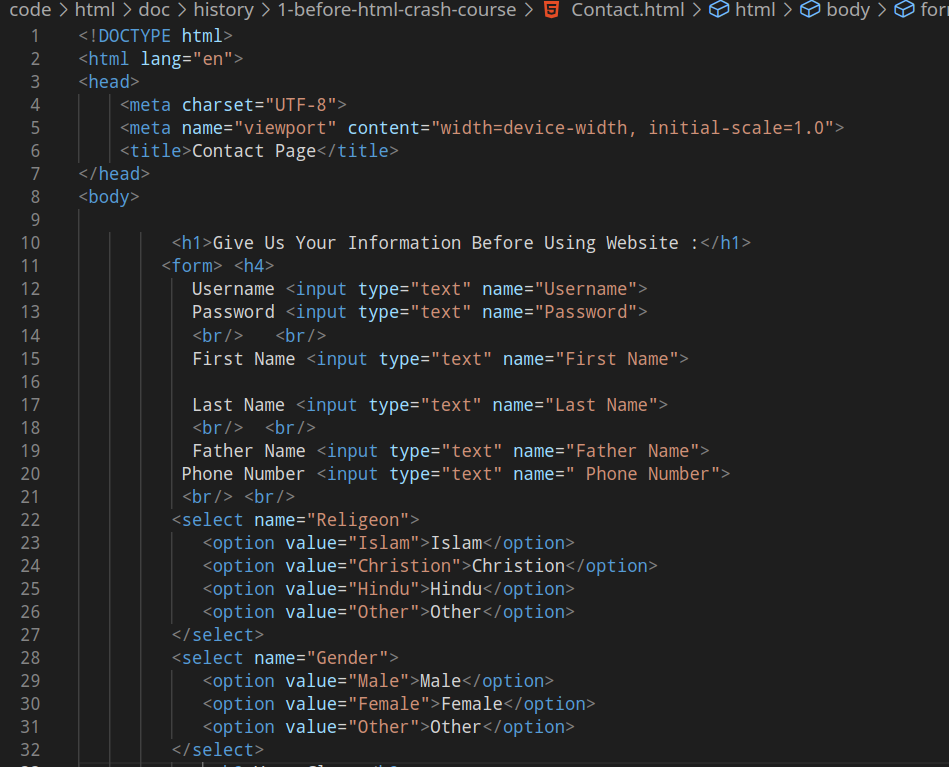
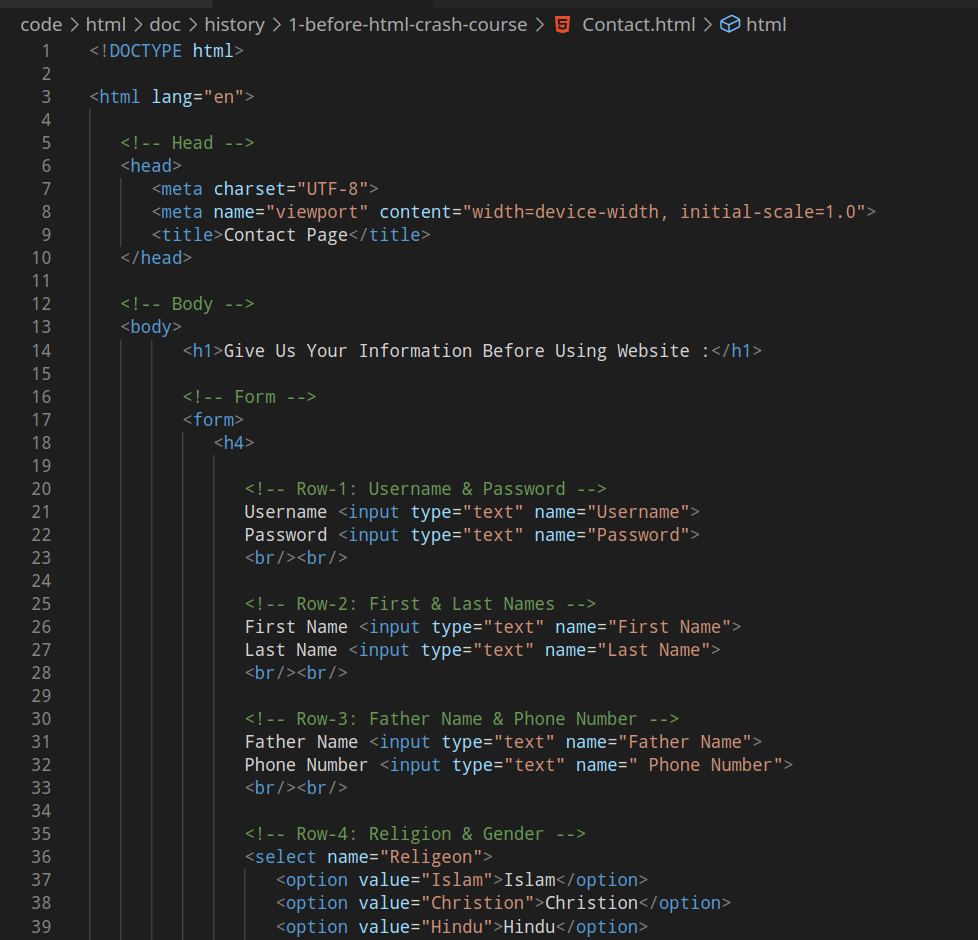

## Clean Code & Indentation

Code
- works fine
- there are no syntax errors (problems in code)

But:
- we can write more clean code
- so that we can easily read code
- and someone who wants to work on this code in future can also read easily

## Comments

Yes. And also try to add comments, they make the code even more understandable

